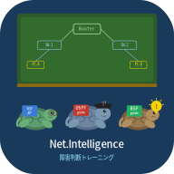

# 🐢 Net.Intelligence

<div align="center">



**実際のサイバー攻撃事例で学ぶ、ネットワーク障害インテリジェンス判断トレーニング**

[](https://flutter.dev)
[](https://dart.dev)
[](https://developer.android.com)
[](LICENSE)
[](https://github.com/tokotokokame/net-Intelligence/actions)
[](https://github.com/tokotokokame/net-Intelligence/releases/latest)

[** APKをダウンロード**](https://github.com/tokotokokame/net-Intelligence/releases/latest) · [スクリーンショット](#スクリーンショット) · [シナリオ一覧](#シナリオ一覧) · [使い方](#使い方) · [開発者向け](#開発者向けビルド方法)

</div>

---

## 📖 概要

**Net.Intelligence** は、実際に発生したサイバー攻撃・ネットワーク障害のケースをもとに作成した **判断トレーニングアプリ** です。

Syslogや監視ツールのアラートを読み解き、「何が起きているか」「次に何をすべきか」を選択肢から判断するゲーム形式で、現場で使えるインシデント対応力を身に付けられます。

```
実際のSyslogを読む  →  原因を特定する  →  対処の優先順位を判断する  →  解説で学ぶ
```

### こんな人に向いています

| 対象 | 活用シーン |
|------|-----------|
| ① CCNA/CCNP を勉強中の方 | 座学で学んだ知識を実際の障害シナリオで試す |
| ② ネットワーク・セキュリティエンジニア | オンコール対応や初動判断のトレーニング |
| ③ 情報システム担当者 | インシデント対応フローの理解と実践練習 |
| ④ セキュリティ教育の講師 | 授業・研修教材として使用 |

---

##  特徴

### 📋 実際の攻撃事例に基づくシナリオ
- 2022〜2025年に実際に発生した国内企業へのサイバー攻撃事例を参考に作成
- ランサムウェア・DDoS・フィッシング・サプライチェーン攻撃など22種類の攻撃手口をカバー
- 各問題に「正解の理由」「次に確認すること」「関連CLIコマンド」「参考資料」を掲載

### 🎮 ゲーム形式の判断トレーニング
- **ログ解読チャレンジ**: Syslog・イベントログから何が起きているかを4択で判断
- **判断フローゲーム**: インシデント対応の優先順位を選択肢から判断
- 選択後に即時フィードバックと詳細な解説を表示

### 📊 習熟度トラッキング
- カテゴリ別（L1-L2障害・L3障害・セキュリティ・キャパシティ）の正解率を記録
- 棒グラフと進捗バーで弱点を可視化
- 累計スコアで達成感を得られる

### 🔒 オフライン動作・プライバシー配慮
- 外部APIへの通信なし・完全オフライン動作
- すべての学習データはデバイス内のSQLiteに保存
- インターネット接続不要

---

## 📥 インストール

### 方法1: APKを直接インストール（推奨）

1. [**Releases ページ**](https://github.com/tokotokokame/net-Intelligence/releases/latest) から `app-release.apk` をダウンロード
2. Android の設定を開く
3. `設定 → セキュリティ → 提供元不明のアプリ` を許可
4. ダウンロードした APK をタップしてインストール

> **動作確認済み環境**: Android 8.0 (API 26) 以上

### 方法2: ソースからビルド

[開発者向けビルド方法](#開発者向けビルド方法) を参照してください。

---

##  スクリーンショット

| ホーム画面 | シナリオ一覧 | ログ解読チャレンジ |
|:---:|:---:|:---:|
| カテゴリ選択 | 難易度別フィルタ | Syslog表示 + 4択 |

| 解説パネル | 判断フロー | 習熟度マップ |
|:---:|:---:|:---:|
| 次のアクション + CLIコマンド | 対応優先順位の選択 | カテゴリ別正解率グラフ |

---

## 🗂️ シナリオ一覧

現在 **29シナリオ・58問** を収録しています。

### 🛡️ 実際のサイバー攻撃事例（22シナリオ）

| # | タイトル | 攻撃手口 | 難易度 | 参考実例 |
|---|---------|---------|--------|---------|
| 1 | VPN機器の脆弱性を突いたランサムウェア侵入 | VPN脆弱性→ランサム | 中級 | 自動車部品メーカー（2022） |
| 2 | フィッシングメール→Active Directory完全掌握 | フィッシング→AD侵害 | 上級 | メディア企業（2024） |
| 3 | サプライチェーン攻撃：委託先から本社へ侵入 | サプライチェーン | 上級 | 生命保険会社（2024） |
| 4 | リスト型攻撃：不正ログインによる顧客情報漏洩 | リスト型攻撃 | 初級 | 大手小売アプリ（2022） |
| 5 | ランサムウェアによる港湾物流システム停止 | OTランサムウェア | 中級 | 名古屋港NUTS（2023） |
| 6 | DDoS攻撃による金融サービス停止（年末年始） | DDoS | 初級 | 大手銀行群（2024〜2025） |
| 7 | SQLインジェクションによるデータベース改ざん | SQLi | 中級 | 医薬品DB（2024） |
| 8 | ランサムウェアによるバックアップデータの同時破壊 | バックアップ破壊 | 上級 | 製粉大手グループ |
| 9 | クラウドIAMキー漏洩によるS3バケット削除 | クラウドIAM悪用 | 上級 | エネクラウド（2025） |
| 10 | 海外子会社経由のラテラルムーブメント | サプライチェーン | 中級 | 文具大手（2023） |
| 11 | ファイアウォール設定ミスによる不正侵入 | FW設定ミス | 初級 | 東海国立大学機構（2022） |
| 12 | 連携先サーバからの大規模個人情報漏洩 | 第三者経由漏洩 | 中級 | IT通信企業（2023） |
| 13 | 業務委託先ランサムウェア→複数企業への情報漏洩連鎖 | 委託先ランサム連鎖 | 上級 | 印刷会社（2024） |
| 14 | ネットワーク接続IoT機器の脆弱性悪用 | IoT踏み台 | 中級 | オフィス環境全般 |
| 15 | RDP開放による中小企業へのランサムウェア感染 | RDPブルートフォース | 初級 | 中小企業全般 |
| 16 | 二重恐喝：データ暗号化＋ダークウェブ公開脅迫 | 二重恐喝 | 上級 | 医療機関（2024〜2025） |
| 17 | Webスキミング（クレジットカード情報の盗み取り） | Webスキミング | 中級 | ECサイト全般 |
| 18 | 長期潜伏型APT：侵入から数ヶ月後に発覚 | APT | 上級 | 重要インフラ全般 |
| 19 | メール誤送信・内部不正による情報漏洩 | 内部脅威 | 初級 | 全業種 |
| 20 | 長期休暇中の無人監視すきを狙った侵入 | 休暇中攻撃 | 中級 | 全業種（GW・年末年始） |
| 21 | DNSキャッシュポイズニングによる偽サイト誘導 | DNSポイズニング | 上級 | Webサービス全般 |
| 22 | 仮想化基盤（VMware ESXi）の直接攻撃 | ESXi直接攻撃 | 上級 | データセンター（2024） |

###  ネットワーク障害シナリオ（7シナリオ）

| カテゴリ | タイトル | 難易度 |
|---------|---------|--------|
| L1-L2 | 物理リンク断絶によるOSPFネイバー消失 | 初級 |
| L1-L2 | VLANミス設定によるセグメント分離 | 中級 |
| L3 | デフォルトルート消失によるインターネット全断 | 初級 |
| L3 | OSPFネイバーが確立しない原因特定 | 中級 |
| セキュリティ | DDoS攻撃受信時の初動対応優先順位 | 中級 |
| キャパシティ | 帯域逼迫の原因特定と対処 | 上級 |

---

## 🎓 使い方

### 1. カテゴリを選ぶ

ホーム画面でカテゴリを選択します。

```
すべて / L1-L2障害 / L3障害 / セキュリティ / キャパシティ
```

### 2. シナリオを選ぶ

シナリオ一覧から気になるシナリオをタップします。難易度バッジを参考にしてください。

- 🟢 **初級**: ネットワーク基礎・CCNA レベル
- 🟠 **中級**: トラブルシューティング実践・CCNP レベル
- 🔴 **上級**: セキュリティインシデント対応・実務経験者向け

### 3. Syslogを読んで答える

提示されたSyslog・監視アラートを読み、4つの選択肢から最も適切なものを選びます。

```
📋 Syslog
┌─────────────────────────────────────────────────────────┐
│ Mar 22 02:14:33 FW-01 %FW-3-CONN: Unusual connection    │
│   src=203.0.113.45 dst=10.0.0.1:443 (SSL-VPN)          │
│ Mar 22 02:15:01 VPN-GW %SSL-3-AUTH: Certificate bypass  │
│   CVE-2021-22893: Pre-auth RCE detected                 │
└─────────────────────────────────────────────────────────┘

 何が起きているか選んでください

  ○ DDoS攻撃によりVPN機器がダウンした
  ● VPN機器の既知脆弱性を悪用して侵入し、ランサムウェアが実行された
  ○ 内部社員が故意にファイルを削除した
  ○ ファイルサーバのストレージが故障した

             [答え合わせ]
```

### 4. 解説で学ぶ

答え合わせ後に詳細な解説が表示されます。

- **何が起きていたか**: インシデントの全体像
- **次に確認すること**: 具体的な対処手順
- **関連CLIコマンド**: コピーして使えるコマンド例
- **参考資料**: CVE番号・RFC・試験範囲の参照先

### 5. 習熟度を確認する

ホーム画面右上の 📊 から習熟度マップを確認できます。カテゴリ別の正解率グラフで弱点を把握しましょう。

---

## 🏗️ 開発者向けビルド方法

### 必要環境

| ツール | バージョン |
|-------|-----------|
| Flutter | 3.41.6 以上 |
| Dart | 3.11.4 以上 |
| Android SDK | API 37 |
| Java | 17 以上 |

### セットアップ

```bash
# リポジトリをクローン
git clone https://github.com/tokotokokame/net-Intelligence.git
cd net-Intelligence

# 依存パッケージのインストール
flutter pub get

# 静的解析
flutter analyze

# テスト実行
flutter test

# デバッグビルド
flutter run

# リリースビルド
flutter build apk --release
```

### CI/CD

`main` ブランチへの push 時に GitHub Actions が自動で以下を実行します。

```
flutter analyze → flutter test → flutter build apk --release → GitHub Releases に公開
```

---

## 📁 プロジェクト構成

```
net_intelligence/
├── lib/
│   ├── main.dart                    # エントリーポイント
│   ├── app/
│   │   ├── app.dart                 # MaterialApp + ダークテーマ
│   │   └── router.dart              # GoRouter 全ルート定義
│   ├── models/
│   │   ├── scenario.dart            # シナリオモデル
│   │   ├── question.dart            # 問題モデル
│   │   ├── choice.dart              # 選択肢モデル
│   │   ├── explanation.dart         # 解説モデル
│   │   └── user_progress.dart       # 習熟度・スコアモデル
│   ├── data/
│   │   ├── seed_scenarios.dart      # 29シナリオ（静的データ）
│   │   └── seed_questions.dart      # 58問・全解説（静的データ）
│   ├── repositories/
│   │   ├── scenario_repository.dart # SQLite CRUD
│   │   └── progress_repository.dart # 進捗保存 SQLite
│   ├── providers/                   # Riverpod プロバイダ
│   └── ui/
│       ├── screens/
│       │   ├── home_screen.dart
│       │   ├── scenario_list_screen.dart
│       │   ├── scenario_detail_screen.dart
│       │   ├── log_challenge_screen.dart
│       │   └── progress_screen.dart
│       └── widgets/
│           ├── scenario_card.dart
│           ├── log_viewer.dart
│           ├── choice_button.dart
│           └── explanation_panel.dart
├── test/
│   ├── models/scenario_test.dart    # モデルユニットテスト
│   ├── repositories/progress_repository_test.dart
│   └── data/seed_data_test.dart     # シナリオ整合性テスト
├── assets/
│   └── icon/                        # アプリアイコン（各解像度）
└── .github/
    └── workflows/build.yml          # GitHub Actions CI/CD
```

---

## 🛠️ 技術スタック

| 分類 | 技術 |
|------|------|
| フレームワーク | Flutter 3.41.6 / Dart 3.11.4 |
| 状態管理 | Riverpod 2.x |
| ルーティング | GoRouter 13.x |
| データベース | SQLite (sqflite 2.x) |
| グラフ表示 | fl_chart |
| ターゲット | Android API 26〜37 |
| CI/CD | GitHub Actions → GitHub Releases |
| 開発環境 | Parrot Security OS (Linux) |

---

## 🤝 コントリビューション

Issue・Pull Request を歓迎します。詳細は [CONTRIBUTING.md](CONTRIBUTING.md) をご覧ください。

### シナリオの追加・修正

新しい攻撃事例のシナリオを追加したい場合は、以下のファイルを編集してください。

- `lib/data/seed_scenarios.dart` — シナリオ定義
- `lib/data/seed_questions.dart` — 問題・選択肢・解説

フォーマットについては既存のデータを参考にしてください。

### バグ報告

[Issues](https://github.com/tokotokokame/net-Intelligence/issues) から報告してください。以下の情報を含めていただけると助かります。

- Android バージョン
- 発生手順
- 期待する動作・実際の動作

---

## ⚖️ ライセンス

このプロジェクトは [MIT License](LICENSE) のもとで公開されています。

---

## 🙏 謝辞

シナリオ作成にあたり、以下の公開情報を参考にしました。

- [IPA 情報セキュリティ10大脅威](https://www.ipa.go.jp/security/10threats/)
- [JPCERT/CC インシデント報告](https://www.jpcert.or.jp/)
- [警察庁 サイバー犯罪対策](https://www.npa.go.jp/cyber/)
- [MITRE ATT&CK Framework](https://attack.mitre.org/)
- [NIST Cybersecurity Framework](https://www.nist.gov/cyberframework)
- 各社公開のインシデント報告書（匿名化・一般化して使用）

> ⚠️ 本アプリのシナリオは教育目的で作成されており、実在の企業・組織を特定・批判するものではありません。実際の被害企業名は匿名化・一般化しています。

---

<div align="center">

**Net.Intelligence** — 黒板の前で勉強する亀たちのように、コツコツ学ぼう 🐢

Made with ❤️ using Flutter

</div>
